# Lexia Dyslexia Learning Game - Entity Relationship Diagram (ERD)

## Database: Firebase Firestore
**Collection:** `dyslexia_users`

---

## ERD in Mermaid Syntax (for Draw.io or Mermaid Live Editor)

```mermaid
erDiagram
    USER ||--|| PROFILE : has
    USER ||--|| STATS : has
    USER ||--|| CHARACTERS : manages
    USER ||--|| DUNGEONS : progresses_through
    USER ||--|| MODULES : completes
    USER ||--|| WORD_CHALLENGES : tracks
    USER ||--|| STAGE_TIMES : records
    USER ||--|| WHITEBOARD_STATS : accumulates
    USER ||--|| STT_STATS : accumulates
    
    DUNGEONS ||--o{ DUNGEON_COMPLETED : contains
    DUNGEONS ||--|| DUNGEON_PROGRESS : tracks
    
    MODULES ||--|| PHONICS : includes
    MODULES ||--|| FLIP_QUIZ : includes
    MODULES ||--|| READ_ALOUD : includes
    
    FLIP_QUIZ ||--|| ANIMALS_QUIZ : contains
    FLIP_QUIZ ||--|| VEHICLES_QUIZ : contains
    
    READ_ALOUD ||--|| GUIDED_READING : contains
    READ_ALOUD ||--|| SYLLABLE_WORKSHOP : contains
    
    WORD_CHALLENGES ||--|| CHALLENGE_COMPLETED : tracks
    WORD_CHALLENGES ||--|| CHALLENGE_FAILED : tracks
    
    STAGE_TIMES ||--o{ DUNGEON_STAGE_TIMES : contains
    
    USER {
        string user_id PK "Firebase Auth UID"
        string auth_method "email or google oauth"
        timestamp created_at
    }
    
    PROFILE {
        string user_id FK
        string username
        string email
        string birth_date "YYYY-MM-DD"
        int age
        string profile_picture "1-17 or default"
        string rank "bronze, silver, gold"
        timestamp created_at
        float usage_time "seconds"
        int session "session count"
        string last_session_date "YYYY-MM-DD"
    }
    
    STATS {
        string user_id FK
        int level
        int exp
        int health "current HP with character bonus"
        int damage "current DMG with character bonus"
        int durability "current DUR with character bonus"
        int base_health "100"
        int base_damage "10"
        int base_durability "5"
        int energy "max 20"
        float last_energy_update "timestamp"
        string current_character "lexia, ragna, etc"
        string skin "animation path"
    }
    
    CHARACTERS {
        string user_id FK
        int unlocked_count "1-4"
        int selected_character "0-3 index"
        array unlock_notifications_shown "character names"
    }
    
    DUNGEONS {
        string user_id FK
    }
    
    DUNGEON_COMPLETED {
        string dungeon_id "1, 2, 3"
        bool completed
        int stages_completed "0-5"
    }
    
    DUNGEON_PROGRESS {
        int current_dungeon "1-3"
        int current_stage "1-5"
        int enemies_defeated
    }
    
    MODULES {
        string user_id FK
    }
    
    PHONICS {
        bool completed
        float progress "0-100 percentage"
        array letters_completed "A-Z uppercase"
        array sight_words_completed "lowercase words"
        int current_letter_index
        int current_sight_word_index
    }
    
    FLIP_QUIZ {
        bool completed "overall"
        float progress "0-100 percentage"
    }
    
    ANIMALS_QUIZ {
        int current_index
        array sets_completed "animals_set_1, animals_set_2, animals_set_3"
        bool completed
        float progress
    }
    
    VEHICLES_QUIZ {
        int current_index
        array sets_completed "vehicles_set_1, vehicles_set_2, vehicles_set_3"
        bool completed
        float progress
    }
    
    READ_ALOUD {
        bool completed
        float progress
    }
    
    GUIDED_READING {
        array activities_completed "passage_0, passage_1, etc"
        int current_index
        float progress
    }
    
    SYLLABLE_WORKSHOP {
        array activities_completed "word list"
        int current_word_index
    }
    
    WORD_CHALLENGES {
        string user_id FK
    }
    
    CHALLENGE_COMPLETED {
        int stt "speech-to-text count"
        int whiteboard "handwriting count"
    }
    
    CHALLENGE_FAILED {
        int stt "speech-to-text count"
        int whiteboard "handwriting count"
    }
    
    WHITEBOARD_STATS {
        string user_id FK
        int attempts
        int successes
    }
    
    STT_STATS {
        string user_id FK
        int attempts
        int successes
    }
    
    STAGE_TIMES {
        string user_id FK
    }
    
    DUNGEON_STAGE_TIMES {
        string dungeon_key "dungeon_1, dungeon_2, dungeon_3"
        float stage_1 "seconds"
        float stage_2 "seconds"
        float stage_3 "seconds"
        float stage_4 "seconds"
        float stage_5 "seconds"
    }
```



---

## Relationship Details

### 1. USER to Other Entities (All ONE-to-ONE relationships)
- **USER → PROFILE** (1:1) - Each user has exactly one profile
- **USER → STATS** (1:1) - Each user has exactly one stats record
- **USER → CHARACTERS** (1:1) - Each user has one character management record
- **USER → DUNGEONS** (1:1) - Each user has one dungeon progression record
- **USER → MODULES** (1:1) - Each user has one modules record
- **USER → WORD_CHALLENGES** (1:1) - Each user has one word challenge tracker
- **USER → STAGE_TIMES** (1:1) - Each user has one stage times record
- **USER → WHITEBOARD_STATS** (1:1) - Each user has one whiteboard statistics record
- **USER → STT_STATS** (1:1) - Each user has one speech-to-text statistics record

### 2. Nested Relationships (ONE-to-MANY or ONE-to-ONE)

#### DUNGEONS Entity:
- **DUNGEONS → DUNGEON_COMPLETED** (1:3) - Has 3 dungeon completion records (dungeons 1, 2, 3)
- **DUNGEONS → DUNGEON_PROGRESS** (1:1) - Has one progress tracker

#### MODULES Entity:
- **MODULES → PHONICS** (1:1) - Has one phonics module
- **MODULES → FLIP_QUIZ** (1:1) - Has one flip quiz module
- **MODULES → READ_ALOUD** (1:1) - Has one read aloud module

#### FLIP_QUIZ Entity:
- **FLIP_QUIZ → ANIMALS_QUIZ** (1:1) - Has one animals quiz section
- **FLIP_QUIZ → VEHICLES_QUIZ** (1:1) - Has one vehicles quiz section

#### READ_ALOUD Entity:
- **READ_ALOUD → GUIDED_READING** (1:1) - Has one guided reading section
- **READ_ALOUD → SYLLABLE_WORKSHOP** (1:1) - Has one syllable workshop section

#### WORD_CHALLENGES Entity:
- **WORD_CHALLENGES → CHALLENGE_COMPLETED** (1:1) - Tracks completed challenges
- **WORD_CHALLENGES → CHALLENGE_FAILED** (1:1) - Tracks failed challenges

#### STAGE_TIMES Entity:
- **STAGE_TIMES → DUNGEON_STAGE_TIMES** (1:3) - Has 3 dungeon stage time records

---

## Firebase Firestore Collection Structure

### Collection: `dyslexia_users`
**Document ID:** Firebase Auth UID (from Firebase Authentication)

```
dyslexia_users/
└── {user_id}/
    ├── profile/               (nested object)
    ├── stats/                 (nested object)
    │   └── player/           (nested object)
    ├── characters/            (nested object)
    ├── dungeons/              (nested object)
    │   ├── completed/        (nested object)
    │   │   ├── 1/           (nested object)
    │   │   ├── 2/           (nested object)
    │   │   └── 3/           (nested object)
    │   └── progress/         (nested object)
    ├── modules/               (nested object)
    │   ├── phonics/          (nested object)
    │   ├── flip_quiz/        (nested object)
    │   │   ├── animals/     (nested object)
    │   │   └── vehicles/    (nested object)
    │   └── read_aloud/       (nested object)
    ├── guided_reading/        (nested object)
    ├── syllable_workshop/     (nested object)
    ├── word_challenges/       (nested object)
    │   ├── completed/        (nested object)
    │   └── failed/           (nested object)
    ├── whiteboard_stats/      (nested object)
    ├── stt_stats/             (nested object)
    └── stage_times/           (nested object)
        ├── dungeon_1/        (nested object)
        ├── dungeon_2/        (nested object)
        └── dungeon_3/        (nested object)
```

---

## Entity Descriptions

### PRIMARY ENTITY

#### **USER**
- **Purpose:** Root document representing a registered player
- **Primary Key:** `user_id` (Firebase Auth UID)
- **Authentication Methods:** Email/Password, Google OAuth
- **Document Location:** `/dyslexia_users/{user_id}`

---

### CORE ENTITIES (Direct children of USER)

#### **PROFILE**
- **Purpose:** Stores user identity and account metadata
- **Relationship:** USER → PROFILE (1:1)
- **Key Fields:**
  - `username`: Display name (3-25 chars, dyslexia-friendly)
  - `email`: Authentication email
  - `birth_date`: YYYY-MM-DD format
  - `age`: Calculated age (5-7 target demographic)
  - `profile_picture`: Avatar ID (1-17 or "default")
  - `rank`: Bronze/Silver/Gold progression tier
  - `usage_time`: Total time in app (seconds)
  - `session`: Total login count
  - `last_session_date`: Last activity date

#### **STATS (Player)**
- **Purpose:** Tracks character combat statistics and progression
- **Relationship:** USER → STATS (1:1)
- **Key Fields:**
  - `level`: Player level (1-99)
  - `exp`: Experience points
  - `health`: Current HP (base + character bonus)
  - `damage`: Current attack (base + character bonus)
  - `durability`: Current defense (base + character bonus)
  - `base_health`: Starting HP (100)
  - `base_damage`: Starting attack (10)
  - `base_durability`: Starting defense (5)
  - `energy`: Battle energy (max 20, regenerates over time)
  - `current_character`: Active character name (lexia, ragna, etc)
  - `skin`: Animation scene path

#### **CHARACTERS**
- **Purpose:** Manages character unlocks and selection
- **Relationship:** USER → CHARACTERS (1:1)
- **Key Fields:**
  - `unlocked_count`: Number of characters unlocked (1-4)
  - `selected_character`: Active character index (0-3)
  - `unlock_notifications_shown`: Array of character names for which unlock notifications have been displayed

**Character System:**
- **Lexia** (Default): +5 HP, +3 DMG, +2 DUR
- **Ragna**: +10 HP, +5 DMG, +0 DUR
- **Solara**: +0 HP, +10 DMG, +5 DUR
- **Terra**: +15 HP, +0 DMG, +3 DUR

#### **DUNGEONS**
- **Purpose:** Tracks dungeon completion and current progress
- **Relationship:** USER → DUNGEONS (1:1)
- **Child Entities:**
  - **DUNGEON_COMPLETED** (1:3) - One per dungeon (1, 2, 3)
    - `completed`: Boolean completion status
    - `stages_completed`: Number of stages completed (0-5)
  - **DUNGEON_PROGRESS** (1:1) - Current progress tracker
    - `current_dungeon`: Active dungeon (1-3)
    - `current_stage`: Active stage (1-5)
    - `enemies_defeated`: Total enemies defeated

**Dungeon Progression:**
- Dungeon 1: "The Plain" (5 stages)
- Dungeon 2: "The Forest" (5 stages)
- Dungeon 3: "The Mountain" (5 stages)

#### **MODULES**
- **Purpose:** Parent container for all learning modules
- **Relationship:** USER → MODULES (1:1)
- **Child Entities:**
  - **PHONICS** (1:1)
  - **FLIP_QUIZ** (1:1)
  - **READ_ALOUD** (1:1)

---

### MODULE ENTITIES (Children of MODULES)

#### **PHONICS**
- **Purpose:** Letter recognition and sight word practice
- **Relationship:** MODULES → PHONICS (1:1)
- **Key Fields:**
  - `completed`: Overall completion status
  - `progress`: Percentage (0-100)
  - `letters_completed`: Array of uppercase letters (A-Z, max 26)
  - `sight_words_completed`: Array of lowercase words (max 20)
  - `current_letter_index`: Current letter position (0-25)
  - `current_sight_word_index`: Current word position (0-19)

**Learning Content:**
- 26 letters (A-Z uppercase)
- 20 sight words (the, and, to, will, of, in, is, you, that, it, he, was, for, on, are, as, with, his, they, at)

#### **FLIP_QUIZ**
- **Purpose:** Image-based learning with two categories
- **Relationship:** MODULES → FLIP_QUIZ (1:1)
- **Child Entities:**
  - **ANIMALS_QUIZ** (1:1)
    - `current_index`: Current position
    - `sets_completed`: Array of completed sets (animals_set_1, animals_set_2, animals_set_3)
    - `completed`: Boolean completion status
    - `progress`: Percentage (0-100)
  - **VEHICLES_QUIZ** (1:1)
    - `current_index`: Current position
    - `sets_completed`: Array of completed sets (vehicles_set_1, vehicles_set_2, vehicles_set_3)
    - `completed`: Boolean completion status
    - `progress`: Percentage (0-100)

#### **READ_ALOUD**
- **Purpose:** Reading comprehension and syllable practice
- **Relationship:** MODULES → READ_ALOUD (1:1)
- **Key Fields:**
  - `completed`: Overall completion status
  - `progress`: Percentage (0-100)

**Child Entities:**
- **GUIDED_READING** (1:1)
  - `activities_completed`: Array of completed passages (passage_0, passage_1, etc)
  - `current_index`: Current passage position
  - `progress`: Percentage (0-100)
- **SYLLABLE_WORKSHOP** (1:1)
  - `activities_completed`: Array of completed words
  - `current_word_index`: Current word position

---

### ANALYTICS ENTITIES

#### **WORD_CHALLENGES**
- **Purpose:** Tracks word recognition success/failure rates
- **Relationship:** USER → WORD_CHALLENGES (1:1)
- **Child Entities:**
  - **CHALLENGE_COMPLETED** (1:1)
    - `stt`: Speech-to-text success count
    - `whiteboard`: Handwriting success count
  - **CHALLENGE_FAILED** (1:1)
    - `stt`: Speech-to-text failure count
    - `whiteboard`: Handwriting failure count

#### **WHITEBOARD_STATS**
- **Purpose:** Tracks handwriting recognition analytics
- **Relationship:** USER → WHITEBOARD_STATS (1:1)
- **Key Fields:**
  - `attempts`: Total handwriting attempts
  - `successes`: Successful recognitions

**Success Rate Calculation:** `(successes / attempts) * 100`

#### **STT_STATS**
- **Purpose:** Tracks speech-to-text recognition analytics
- **Relationship:** USER → STT_STATS (1:1)
- **Key Fields:**
  - `attempts`: Total speech attempts
  - `successes`: Successful recognitions

**Success Rate Calculation:** `(successes / attempts) * 100`

#### **STAGE_TIMES**
- **Purpose:** Records completion time for each dungeon stage
- **Relationship:** USER → STAGE_TIMES (1:1)
- **Child Entities:**
  - **DUNGEON_STAGE_TIMES** (1:3) - One per dungeon
    - `dungeon_1`: Object with stage_1 through stage_5 (seconds)
    - `dungeon_2`: Object with stage_1 through stage_5 (seconds)
    - `dungeon_3`: Object with stage_1 through stage_5 (seconds)

---

## Cardinality Summary

### ONE-to-ONE (1:1) Relationships
- USER ↔ PROFILE
- USER ↔ STATS
- USER ↔ CHARACTERS
- USER ↔ DUNGEONS
- USER ↔ MODULES
- USER ↔ WORD_CHALLENGES
- USER ↔ STAGE_TIMES
- USER ↔ WHITEBOARD_STATS
- USER ↔ STT_STATS
- DUNGEONS ↔ DUNGEON_PROGRESS
- MODULES ↔ PHONICS
- MODULES ↔ FLIP_QUIZ
- MODULES ↔ READ_ALOUD
- FLIP_QUIZ ↔ ANIMALS_QUIZ
- FLIP_QUIZ ↔ VEHICLES_QUIZ
- READ_ALOUD ↔ GUIDED_READING
- READ_ALOUD ↔ SYLLABLE_WORKSHOP
- WORD_CHALLENGES ↔ CHALLENGE_COMPLETED
- WORD_CHALLENGES ↔ CHALLENGE_FAILED

### ONE-to-MANY (1:N) Relationships
- DUNGEONS → DUNGEON_COMPLETED (1:3) - Fixed 3 dungeons
- STAGE_TIMES → DUNGEON_STAGE_TIMES (1:3) - Fixed 3 dungeons

### NO MANY-to-MANY Relationships
This database uses a **nested document structure** in Firebase Firestore with no many-to-many relationships. All relationships are either one-to-one or one-to-many with fixed cardinality.

---

## Data Normalization Notes

### Firestore NoSQL Design Decisions:

1. **Denormalization for Performance:**
   - All user data is stored in a single document (`dyslexia_users/{user_id}`)
   - Nested objects instead of separate collections
   - Optimized for read-heavy operations

2. **Array-Based Progress Tracking:**
   - `letters_completed`: Array of completed letters
   - `sight_words_completed`: Array of completed words
   - `activities_completed`: Array of completed activities
   - Enables quick lookup and progress calculation

3. **Embedded Analytics:**
   - Stats aggregated in same document
   - Reduces query count for leaderboards
   - Real-time progress tracking

4. **No Relations Across Documents:**
   - Each user document is self-contained
   - No foreign keys to other collections
   - Simplifies querying and reduces latency

---

## Indexing Strategy for Leaderboards

### Required Composite Indexes:

```javascript
// Dungeon Rankings Leaderboard
collection: dyslexia_users
fields: 
  - dungeons.progress.current_dungeon (Ascending)
  - dungeons.progress.current_stage (Ascending)

// Power Scale Leaderboard
collection: dyslexia_users
fields:
  - stats.player.level (Descending)
  - stats.player.exp (Descending)

// Word Masters Leaderboard
collection: dyslexia_users
fields:
  - word_challenges.completed.stt (Descending)
  - word_challenges.completed.whiteboard (Descending)

// Phonics Progress Leaderboard
collection: dyslexia_users
fields:
  - modules.phonics.progress (Descending)

// Read Aloud Leaderboard
collection: dyslexia_users
fields:
  - guided_reading.progress (Descending)

// Flip Quiz Leaderboard
collection: dyslexia_users
fields:
  - modules.flip_quiz.progress (Descending)
```

---

## Authentication Integration

### Firebase Authentication:
- **User ID Generation:** Handled by Firebase Auth
- **Auth Methods:**
  - Email/Password (with strength validation)
  - Google OAuth (redirect flow for web, localhost for desktop)
- **Persistence:** 
  - Web: localStorage with Firebase Persistence.LOCAL
  - Desktop: File-based auth storage
- **Terms Acceptance:** Required before first login/registration

### User Creation Flow:
1. User registers via Authentication.gd
2. Firebase Auth creates UID
3. Firestore document created at `dyslexia_users/{UID}` with default values
4. Default character: Lexia (+5 HP, +3 DMG, +2 DUR)

---

## Data Access Patterns

### Common Queries:

```gdscript
# Get user profile
var collection = Firebase.Firestore.collection("dyslexia_users")
var doc = await collection.get_doc(user_id)

# Update phonics progress
await collection.update_doc({
  "modules.phonics.letters_completed": ["A", "B", "C"],
  "modules.phonics.progress": 11.53
})

# Update dungeon progress
await collection.update_doc({
  "dungeons.progress.current_dungeon": 2,
  "dungeons.progress.current_stage": 3,
  "dungeons.progress.enemies_defeated": 15
})

# Track whiteboard attempt
await collection.update_doc({
  "whiteboard_stats.attempts": FieldValue.increment(1),
  "whiteboard_stats.successes": FieldValue.increment(1)
})
```

---

## Draw.io ERD Creation Guide

### To create this ERD in Draw.io:

1. **Import Mermaid Diagram:**
   - Open Draw.io (https://app.diagrams.net/)
   - Click "Arrange" → "Insert" → "Advanced" → "Mermaid"
   - Paste the Mermaid syntax above
   - Click "Insert"

2. **Manual Creation:**
   - Use "Entity Relation" shape library
   - Add entities as rectangles with fields
   - Connect with relationship lines:
     - **Solid line** for one-to-one (1:1)
     - **Line with crow's foot** for one-to-many (1:N)
   - Label relationships with cardinality (1:1, 1:3, etc.)

3. **Color Coding Suggestions:**
   - **Blue:** Core user entities (USER, PROFILE, STATS)
   - **Green:** Module entities (PHONICS, FLIP_QUIZ, READ_ALOUD)
   - **Orange:** Analytics entities (WORD_CHALLENGES, WHITEBOARD_STATS, STT_STATS)
   - **Purple:** Dungeon entities (DUNGEONS, DUNGEON_COMPLETED)
   - **Gray:** Time tracking entities (STAGE_TIMES)

---

## Additional Resources

- **Firebase Firestore Documentation:** https://firebase.google.com/docs/firestore
- **Mermaid Live Editor:** https://mermaid.live/
- **Draw.io:** https://app.diagrams.net/

---

**Last Updated:** October 21, 2025  
**Version:** 1.0  
**Author:** AI Assistant for Lexia Dyslexia Learning Game
