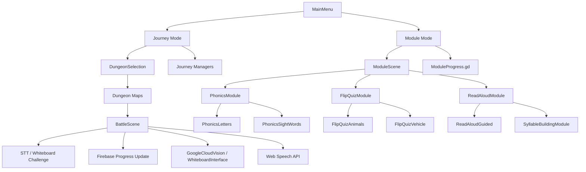

# Lexia Web Game Manual

## 1. Project Summary

Lexia is a Godot 4.4.5-4.6 web-based educational game designed for dyslexic learners, primarily children. The system combines learning activities, progress persistence, and game-like feedback into a browser-playable experience that supports reading practice, writing practice, and spoken-word interaction.

The project is built around two major gameplay modes:

- Journey Mode: RPG-style dungeon progression with automatic battles, STT/whiteboard word challenges, and character stat growth.
- Module Mode: Direct learning modules for phonics, flip practice, and read-aloud activities with Firebase-backed progress tracking.

The game is web-first, with Godot exporting to HTML5 and a Firebase-backed backend for authentication, storage, and progress persistence.

## 2. Design Goals

The codebase is structured around accessibility for dyslexic users. The main goals are:

- Reduce reading pressure through clear layouts and low-distraction UI.
- Support multisensory learning with text, speech, writing, and visual feedback.
- Keep feedback immediate, forgiving, and visually clear.
- Persist learner progress so sessions can continue over time.
- Run in the browser without requiring a native install.

## 3. High-Level System Architecture



## 4. Core Modes

### 4.1 Journey Mode

Journey Mode is the game-like progression path. It uses battle scenes, dungeon maps, and manager scripts to coordinate gameplay. The player advances through three dungeons, each with five stages, and completes word challenges to influence battle outcomes.

Main characteristics:

- Auto turn-based battle flow.
- STT and whiteboard word recognition challenges.
- Progressive difficulty by dungeon:
  - Dungeon 1: 3-letter words
  - Dungeon 2: 4-letter words
  - Dungeon 3: 5-letter words
- Firebase-backed player stats and dungeon progression.
- Signals connect managers rather than using tightly coupled direct calls.

Key files:

- [Scenes/BattleScene.tscn](Scenes/BattleScene.tscn)
- [Scripts/battlescene.gd](Scripts/battlescene.gd)
- [Scripts/JourneyManager/player_manager.gd](Scripts/JourneyManager/player_manager.gd)
- [Scripts/JourneyManager/battle_manager.gd](Scripts/JourneyManager/battle_manager.gd)
- [Scripts/JourneyManager/challenge_manager.gd](Scripts/JourneyManager/challenge_manager.gd)
- [Scripts/JourneyManager/ui_manager.gd](Scripts/JourneyManager/ui_manager.gd)
- [Scripts/JourneyManager/dungeon_manager.gd](Scripts/JourneyManager/dungeon_manager.gd)

### 4.2 Module Mode

Module Mode is the direct learning path. It removes battle complexity and focuses on guided learning activities with visible progress tracking.

Current modules:

- Phonics Interactive
  - Letters practice
  - Sight words practice
- Flip Quiz Interactive
  - Animals
  - Vehicles
- Interactive Read-Aloud
  - Guided reading
  - Syllable workshop

Key files:

- [Scenes/ModuleScene.tscn](Scenes/ModuleScene.tscn)
- [Scripts/ModuleScene.gd](Scripts/ModuleScene.gd)
- [Scenes/PhonicsModule.tscn](Scenes/PhonicsModule.tscn)
- [Scripts/PhonicsModule.gd](Scripts/PhonicsModule.gd)
- [Scenes/PhonicsLetters.tscn](Scenes/PhonicsLetters.tscn)
- [Scripts/PhonicsLetters.gd](Scripts/PhonicsLetters.gd)
- [Scenes/PhonicsSightWords.tscn](Scenes/PhonicsSightWords.tscn)
- [Scripts/PhonicsSightWords.gd](Scripts/PhonicsSightWords.gd)
- [Scenes/FlipQuizModule.tscn](Scenes/FlipQuizModule.tscn)
- [Scripts/FlipQuizModule.gd](Scripts/FlipQuizModule.gd)
- [Scenes/ReadAloudModule.tscn](Scenes/ReadAloudModule.tscn)

## 5. Scene Flow

```text
MainMenu.tscn
├── Journey Mode
│   ├── DungeonSelection.tscn
│   ├── Dungeon1Map.tscn / Dungeon2Map.tscn / Dungeon3Map.tscn
│   └── BattleScene.tscn
└── Module Mode
    ├── ModuleScene.tscn
    ├── PhonicsModule.tscn
    │   ├── PhonicsLetters.tscn
    │   └── PhonicsSightWords.tscn
    ├── FlipQuizModule.tscn
    │   ├── FlipQuizAnimals.tscn
    │   └── FlipQuizVehicle.tscn
    └── ReadAloudModule.tscn
        ├── ReadAloudGuided.tscn
        └── SyllableBuildingModule.tscn
```

## 6. Journey Mode Details

### 6.1 Battle Flow

BattleScene loads a set of managers and connects them with signals. The battle flow uses a modular structure so that player stats, enemy behavior, UI, and dungeon progression are handled by separate scripts.

The battle sequence generally follows this pattern:

1. Load player data from Firebase.
2. Initialize managers.
3. Set up the enemy based on dungeon and stage.
4. Begin the battle loop.
5. Trigger a word challenge when the enemy uses a skill.
6. Reward or penalize the player depending on challenge result.
7. Save progress and continue the dungeon.

### 6.2 Challenge System

The challenge system is the key learning mechanic in Journey Mode. It uses STT and whiteboard input to test whether the learner can recognize or write a target word.

Behavior summary:

- Whiteboard input is captured in [Scripts/WhiteboardInterface.gd](Scripts/WhiteboardInterface.gd).
- STT uses browser-based audio and polling patterns in the web build.
- Recognition results are cleaned up with dyslexia-friendly fuzzy matching.
- Success usually grants bonus damage or progression benefits.
- Failure or cancellation triggers enemy skill flow.

Important implementation notes:

- Challenge fail/cancel always uses the enemy skill flow.
- Overlays and result panels are cleaned up to avoid blocking end screens.
- Enemy and player SFX are handled through named audio nodes.

### 6.3 Player Progression

Player progress is stored in Firebase under the `stats`, `dungeons`, `stage_times`, and related fields. The `PlayerManager` handles level, experience, health, damage, durability, and persistence.

Typical player data includes:

- Level and EXP
- Current and base combat stats
- Current character and skin
- Energy and energy recovery timestamps
- Dungeon progress and stage completion

### 6.4 Dungeon Progression

The dungeon system tracks which stage and dungeon the learner is on, along with completion counts and stage timing data.

Progress rules:

- Dungeon completion is stored per dungeon ID.
- Stage progress is tracked separately from combat stats.
- Completed stages are displayed visually in the UI.

## 7. Module Mode Details

### 7.1 Module Scene Hub

[Scripts/ModuleScene.gd](Scripts/ModuleScene.gd) acts as the module selection hub. It loads progress from Firestore and updates the three module cards:

- Phonics
- Flip Quiz
- Read Aloud

It also refreshes progress when the window regains focus.

### 7.2 Phonics Module

Phonics is split into two focused learning paths:

- Letters practice in [Scripts/PhonicsLetters.gd](Scripts/PhonicsLetters.gd)
- Sight words practice in [Scripts/PhonicsSightWords.gd](Scripts/PhonicsSightWords.gd)

The module uses:

- TTS guidance
- Whiteboard tracing and handwriting recognition
- Progress saving through `ModuleProgress`
- Fuzzy matching for dyslexia-friendly recognition
- Letter-only and word-only filtering so non-alphabetic OCR noise is ignored

### 7.3 Flip Quiz Module

Flip Quiz is a card-based activity with two categories:

- Animals
- Vehicles

The module is designed for short, low-pressure sets with immediate feedback and progress persistence.

### 7.4 Read-Aloud Module

Read-Aloud contains guided reading and syllable-based learning. It tracks the learner’s completed activities and resumes from saved progress.

## 8. Authentication and Account Flow

Authentication is handled through Firebase Authentication. The current implementation supports:

- Email/password login
- Google OAuth login
- Terms and privacy acceptance gating before access

The authentication scene also:

- Uses fade-in/fade-out transitions.
- Checks whether the terms popup has already been accepted.
- Restores existing login state on startup.

Key file:

- [Scripts/Authentication.gd](Scripts/Authentication.gd)

## 9. Firebase Data Model

The project stores user data in the `dyslexia_users` Firestore collection. Each user document is keyed by Firebase Auth UID.

Main top-level data groups:

- `profile`
- `stats`
- `characters`
- `dungeons`
- `modules`
- `word_challenges`
- `whiteboard_stats`
- `stt_stats`
- `stage_times`

The system uses a denormalized document structure so progress can be read quickly without joining multiple collections.

For a more formal entity breakdown, see [DATABASE_ERD.md](DATABASE_ERD.md).

## 10. Whiteboard and OCR Pipeline

The whiteboard system is used in both Journey Mode and module-style word exercises.

Current pipeline:

1. User draws on the whiteboard.
2. The drawing is exported to an image.
3. The image is processed in JavaScript for better recognition.
4. OCR returns text results.
5. Godot interprets the result and applies learning logic.

Current implementation files:

- [Scripts/WhiteboardInterface.gd](Scripts/WhiteboardInterface.gd)
- [Scripts/GoogleCloudVision.gd](Scripts/GoogleCloudVision.gd)
- [WebTest/letter_recognition.js](WebTest/letter_recognition.js)

The web build currently uses a browser bridge and image preprocessing. Since Google Cloud Vision trial usage can change, the OCR backend may be swapped later while preserving the same image export flow.

## 11. Accessibility and Dyslexia-Focused Design

The project follows several accessibility principles that are visible in code and UI patterns:

- OpenDyslexic font usage.
- Large, readable labels and strong contrast.
- Gentle transitions instead of abrupt scene changes.
- Progress visibility and supportive feedback.
- No timer pressure by default in learning modules.
- Multisensory learning through seeing, hearing, speaking, and writing.
- Fuzzy matching to reduce frustration from exact OCR requirements.

## 12. Web Deployment and Runtime Notes

The project is exported to a web folder and hosted with Firebase Hosting.

Relevant web folder contents include:

- `index.html`
- `index.js`
- `index.pck`
- `index.manifest.json`
- `index.service.worker.js`
- `letter_recognition.js`

Hosting configuration uses headers for cross-origin isolation so the Godot web build can work correctly with threading and browser APIs.

## 13. Testing and Debugging Approach

The codebase relies heavily on runtime logs and Firebase document inspection.

Common debug patterns:

- Use `print()` in managers and module scripts.
- Check Firebase document keys before reading nested data.
- Refresh module progress when returning to the window.
- Verify scene nodes exist before connecting or updating them.

For the web build, the browser console is important for debugging JavaScript bridge behavior, speech recognition, and OCR issues.

## 14. Key Modules and Responsibilities

### Journey Mode

- BattleManager: battle outcome and scene transitions.
- PlayerManager: player stats and Firebase persistence.
- EnemyManager: enemy behavior, scaling, and animation.
- ChallengeManager: STT/whiteboard challenge coordination.
- UIManager: health bars, labels, stage info, and visuals.
- DungeonManager: dungeon and stage state.

### Module Mode

- ModuleScene: module selection and progress overview.
- ModuleProgress: Firestore persistence for learning activities.
- PhonicsModule: phonics hub.
- PhonicsLetters: alphabet tracing practice.
- PhonicsSightWords: sight word practice.
- FlipQuizModule: flip-card learning hub.
- ReadAloudModule: guided reading and syllable work.

## 15. Summary

Lexia is a browser-based Godot learning game that blends educational scaffolding with game progression. Its architecture separates progression-heavy combat gameplay from direct learning activities, while Firebase stores authentication and learner progress.

The codebase is most notable for:

- Two-mode learning architecture.
- Firebase-backed persistence.
- Dyslexia-focused accessibility patterns.
- Browser-based handwriting and speech recognition.
- Modular scene and manager design.

This manual can be used as a research-document companion to explain how the system works at a technical and pedagogical level.
